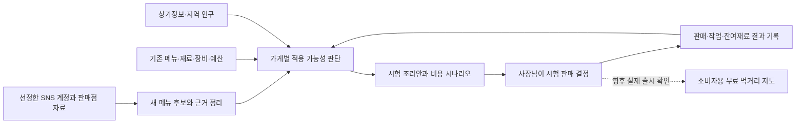
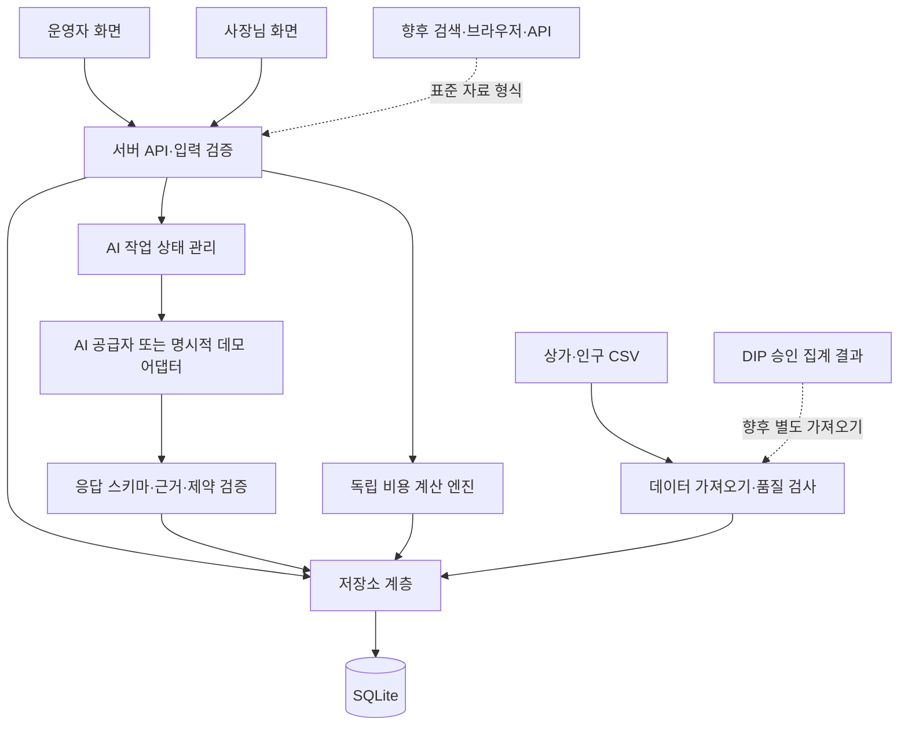

# SNS 신메뉴 AI 컨설팅 — 서비스 기획 및 구현 명세

문서 버전: 1.1 · 최초 작성일: 2026-09-13 · 인계 보강일: 2026-09-14  
용도: 제품 의사결정, AI 코딩 지시, 구현 검수, 대회 제안요약서 작성의 기준 문서  
상태: 구현 전 기획. 아래의 기능·화면·구조는 만들 대상이며, 이미 개발된 기능을 뜻하지 않는다.

## 0. 이 문서를 사용하는 방법

- 이전 대화를 모르면 먼저 [대화 맥락과 대회 배경](대화맥락과_대회배경.md)을 읽는다. 이 기획은 **2026 AI Blockchain Challenge in Daegu**의 **소상공인·골목상권 디지털 금융 → 골목상권 데이터 기반 AI 컨설팅**에서 출발했다.
- 1~5장의 서비스 목적·범위·데이터 원칙을 읽고 [데이터 상세명세](데이터_상세명세.md)의 실제 파일·필드·결합 방법을 확인한다.
- 6장의 기능 명세를 기능 ID 순서대로 구현한다. 화면만 만든 상태와 실제 데이터 처리 완료를 구분한다.
- 7~10장의 계산 규칙, 데이터 구조, AI 계약, API 계약을 공통 기준으로 사용한다.
- 11~14장의 개발 단계와 수용기준으로 완료 여부를 확인한다.
- 개발 순서와 첫 지시문은 같은 폴더의 `AI코딩_실행계획.md`를 사용한다.
- 요구 변경이 생기면 이 문서와 실행계획을 함께 수정한다. 미구현 기능을 제안서에 구현 완료로 적지 않는다.

## 1. 한눈에 보는 서비스

### 1.1. 서비스 정의

**SNS에서 유행하는 신메뉴를 발견하고, 우리 가게의 재료·장비·예산에 맞춘 소규모 시험 판매를 돕는 AI 컨설팅 서비스.**

초기 대상은 대구의 기존 개인 카페다. 이후 베이커리·떡집으로 확장한다. 브랜딩은 ‘서울 신메뉴’가 아닌 ‘SNS 신메뉴’로 통일한다. 서울 중심의 전국 SNS 계정을 관찰하는 것은 수집 전략이다.

사장님에게 전달하는 핵심 질문은 “정확히 몇 퍼센트 유행하는가?”보다 **“이런 메뉴가 나왔는데, 우리 가게에서 이 방식으로 시험해보겠습니까?”**다.

### 1.2. 핵심 흐름



### 1.3. 핵심 제품 결정

| 항목 | 결정 |
|---|---|
| 초기 고객 | 대구 개인 카페 운영자 |
| 관찰 범위 | 서울을 포함한 전국 신상 음식·디저트·실제 판매점 SNS |
| 제공 빈도 | 주 1~3개 실행 제안이 목표. P0는 요청 시 생성하며 자동 알림은 P1 |
| 컨설팅 깊이 | 메뉴 변형, 시험 조리 초안, 준비물, 비용 시나리오, 실험 기록 |
| 금융 연결 | 시험에 필요한 현금, 사용 원가, 비용 회수 조건을 설명 |
| 초기 검증 방식 | 실제 운영 기능과 명시적인 데모 데이터를 함께 준비 |
| 향후 과금 | 사장님 컨설팅 구독. 초기 결제 기능은 구현하지 않음 |
| 향후 소비자 기능 | 실제 판매가 확인된 SNS 먹거리 무료 지도 |
| 블록체인 | 초기 구현에서 제외. 필요성과 대회 요건을 확인한 뒤 별도 판단 |

## 2. 논의 배경과 기획이 정리된 과정

### 2.1. 출발한 문제

사장님은 신메뉴를 찾기 위해 여러 SNS를 살펴보고, 자신의 가게에서 만들 수 있는지 검토하며, 재료를 구매하고, 시험 판매 결과를 판단해야 한다. 정보 탐색과 실행 사이에 시간·비용·판단 부담이 있다.

두쫀쿠·버터떡·피자설기 등은 대화에서 아이디어를 설명하기 위해 언급된 사례다. 이 문서는 이들이 현재 모두 유행한다고 판정하지 않는다. ‘AI 때문에 유행 주기가 6개월에서 7일~1개월로 짧아졌다’는 주장도 검증된 사실로 사용하지 않는다.

### 2.2. 논의에서 확정한 방향

| 논의 | 최종 반영 |
|---|---|
| 상가 공공데이터로 AI 컨설팅이 가능한가 | 위치·업종·지역 설명에 활용하고 메뉴·수요는 다른 자료로 보완 |
| 유료 분석 API와 웹 에이전트 중 무엇을 쓸까 | 첫 구현은 선정한 SNS 근거를 이용한다. 유료 API는 필요가 검증되면 추가 |
| 정량적인 유행 측정이 꼭 필요한가 | 시장 전체 순위보다 근거 있는 후보와 실행 가능성을 우선 |
| 대구 계정만 관찰할까 | 서울 중심을 포함한 전국 계정에서 발견하고 대구 자료는 지역 도입 여부 보조 확인 |
| 이름에 서울을 넣을까 | 서비스 표현은 ‘SNS에서 유행하는 신메뉴’로 통일 |
| 소비자를 어떻게 모을까 | 향후 실제 판매점 무료 지도로 소비자 탐색을 돕는다 |
| 무엇으로 수익을 낼까 | 사장님 대상 컨설팅 구독을 검토. 지도 이용은 무료 |

### 2.3. 가설과 검증할 사항

1. 사장님은 일반적인 유행 요약보다 가게에 맞는 적용안을 더 유용하게 느낀다.
2. 재료·장비·예산 조건을 반영하면 실제 실행 가능한 제안 비율이 높아진다.
3. 다른 지역에서 먼저 관찰된 메뉴를 대구에서 시험하는 것이 일부 가게에 도움이 될 수 있다. 모든 유행의 확산 방향을 서울→대구로 가정하지 않는다.
4. 판매·작업·잔여재료 기록이 다음 제안의 품질을 높인다.
5. 향후 소비자 지도는 가게 발견을 도울 수 있다. 길찾기·저장을 실제 방문·구매로 간주하지 않는다.

## 3. 고객·사용자·성공 기준

### 3.1. 사용자 역할

| 역할 | 할 수 있는 일 |
|---|---|
| 사장님 | 본인 가게 편집, 후보 열람, 적용안 생성, 비용 수정, 시험 기록 |
| 운영자 | 관찰 계정 관리, 자료 등록, AI 추출 검토, 후보 승인·보류 |
| 소비자 | P2 지도에서 실제 판매 메뉴 탐색. P0 기능 없음 |

P0는 로컬 시연용 단일 운영 환경으로 시작한다. 역할 전환은 데모 기능이며 보안 인증을 의미하지 않는다. 실제 사장님 데이터를 받는 파일럿은 P1의 로그인과 가게별 접근 제어가 선행되어야 한다.

### 3.2. 제공 가치

- 탐색: 사장님이 직접 여러 계정을 오가는 시간을 줄인다.
- 판단: 왜 관련 있는지와 무엇이 부족한지 함께 보여준다.
- 실행: 새로운 장비 구매 없이 가능한 변형안을 우선 검토한다.
- 비용: 예산 내 시험이 가능한지 계산한다.
- 학습: 거절 이유와 실행 결과를 다음 추천 조건에 반영한다.

### 3.3. 검증 지표

| 지표 | 정의 |
|---|---|
| 근거 유효율 | 운영자가 표본 검수한 후보 중 원문과 설명이 일치한 비율 |
| 실행 의향률 | 제안을 본 사장님 중 ‘시험 계획 만들기’를 선택한 비율 |
| 실행률 | 사장님에게 제시한 고유 제안 중 실제 진행 상태로 전환된 비율 |
| 재판매 의향 | 종료한 시험 중 계속 판매 또는 재시험을 선택한 비율 |
| 준비 부담 | 사장님이 기록한 탐색·시험 조리·판매 준비 시간 |
| 비용 결과 | 현금 지출, 사용 원가, 잔여·폐기, 실제 판매 수량 |

분모·측정 기간·표본 수를 함께 보여준다. 초기 인터뷰 5~10개 가게의 결과는 탐색적 검증으로 설명하며 보편적 매출 상승률로 일반화하지 않는다.

## 4. 구현 범위

### 4.1. P0 — 대회 프로토타입 필수

| ID | 기능 | 완료 시 얻는 결과 |
|---|---|---|
| F01 | 가게 등록·보유 자원 입력 | 가게 프로필과 버전 |
| F02 | 관찰 계정·근거 자료 등록 | 출처가 남는 자료 목록 |
| F03 | 메뉴 정보 AI 추출·검토 | 승인된 메뉴 후보와 증거 |
| F04 | 후보 목록·상세 | ‘새로 관찰’과 ‘복수 사례’를 구분한 탐색 |
| F05 | 공공데이터 상권 맥락 | 주변 업종·동별 거주인구 요약 |
| F06 | 가게별 적용안 | 가능 조건·부족 조건·시험 조리 초안 |
| F07 | 시험 비용 계산 | 현금 예산·원가·판매량별 결과 |
| F08 | 시험 계획·결과 기록 | 계획 대비 결과 및 다음 결정 |
| F09 | 운영·데모·출처 관리 | 오류 복구, 데이터 구분, 재현 가능한 시연 |

P0 자료 수집은 **운영자가 URL와 확인한 본문·설명을 입력하는 방식**을 반드시 지원한다. 실제 AI 키가 있으면 추출·적용안을 생성한다. 키가 없으면 명시적인 데모 모드만 제공한다. 입력만 받고 저장하지 않거나 클릭마다 같은 샘플을 반환하는 것을 실제 기능으로 보이지 않게 한다.

### 4.2. P1 — 파일럿 및 운영 자동화

- 공개 접근이 허용된 자료에 대한 검색·브라우저 수집 어댑터.
- 여러 사장님 로그인, 가게별 권한, 개인정보 삭제 처리.
- 주간 추천 묶음 생성, 사장님이 동의한 알림 채널 연동.
- 대구 맛집 API를 통한 매장정보 보완.
- 검토·반출 승인을 받은 DIP 집계 결과 적용.
- SNS 링크 수정·삭제 시 재검토와 제안 근거 상태 갱신.

### 4.3. P2 — 향후 확장

- 무료 소비자 먹거리 지도, 실제 출시·품절·판매 종료 관리.
- 유료 사장님 구독 및 결제.
- 베이커리·떡집 업종별 조리·장비 템플릿.
- 충분한 실제 결과를 확보한 후 추천 개인화 개선.

초기 제외: SNS 전체 실시간 수집, 전국 인기 순위, 자동 대출 추천, 특정 메뉴 판매량 예측, 수요·성공 확률 보장, 자동 구매·자동 SNS 게시, 검증된 완제품 레시피 제공.

## 5. 데이터 설계 원칙과 확보 상태

### 5.1. 사용할 자료와 상태

| 자료 | 현재 상태 | 초기 활용 | 제한 |
|---|---|---|---|
| 소진공 대구 상가정보 2026.06 CSV | 저장소에 전체 원본·7,507행 추출본·품질 보고서 포함 | 매장 검색·업종·좌표·행정/법정동 | 메뉴·매출·실제 고객 없음 |
| SNS 근거 | 운영자가 선정·수집할 대상. 아직 서비스 데이터베이스 없음 | 신메뉴 발견·형태·판매 사례 | 게시물 노출이 전체 수요를 뜻하지 않음 |
| 법정동별 성·연령 주민등록 인구 2026.08 | 전국 원본·대구 383행 CSV/JSON 확보, 앱 적재 전 | 동별 거주 연령구조 | 거주인구와 방문객 구분 |
| 대구광역시 맛집 API | 공식 명세 확인, 실제 연동 전 | 매장·메뉴 보완(P1) | 매장별 최신 확인일·전체 포괄성 미확인 |
| 먹거리골목 메뉴·가격 | 공식자료 확인, 2021년 1회성 | P0 핵심 입력에서 제외 | 현재 판매·가격으로 사용 불가 |
| DIP 생활인구·삼성카드 | 2026.09 설명서 확인, 원본 이용 전 | 승인 집계 확보 후 지역 해석(P1) | 방문·폐쇄망 분석·결과물 승인 반출 |
| 가게 메뉴·재료·원가·장비 | 사장님 입력 또는 명시적 데모 | 맞춤 추천·계산 | 최근 확인일과 직접 입력 여부 표시 |

저장소 기준 CSV 위치: `data/raw/소상공인시장진흥공단_상가(상권)정보_대구_202606.csv`. 인구는 `data/raw/population/`에 있다. 다른 환경에서는 이 저장소 상대 경로를 사용한다. 전체 목록은 `data/manifest.json`을 확인한다.

인계 시 재검증값: UTF-8, 39개 컬럼, 118,357개 상가 레코드. 상가 전체 법정동코드가 인구 383개 지역 코드와 일치했다. 카페 5,513개·빵/도넛 1,509개·떡/한과 485개는 당시 파일의 업종 분류 집계다. 현재 영업 여부나 유료 고객 시장 규모로 사용하지 않는다. 실제 가져오기 시 다시 품질 결과를 기록한다.

### 5.2. 자료의 세 층

1. **확인한 사실:** 원문에 나온 메뉴·가격·매장·게시일.
2. **분석한 해석:** 이 메뉴와 우리 가게의 연결 가능성.
3. **실행 가정:** 시험 조리 배합, 판매가 가정, 판매 수량 시나리오.

각 층을 UI와 저장 구조에서 분리한다. 사실 카드에 AI가 만든 재료나 가격을 끼워 넣지 않는다. 불명확한 값은 null과 이유를 저장하며 0으로 대체하지 않는다.

### 5.3. 시간·단위·지역 공통 규칙

- DB 시각은 UTC ISO 8601, 화면과 일자 경계는 Asia/Seoul.
- 게시일, 수집일, 운영자 확인일, 데이터 기준일을 서로 다른 필드로 보관.
- 날짜를 알 수 없으면 null. 수집일을 게시일로 채우지 않는다.
- 공공데이터 동코드는 문자열로 보관. 법정동과 행정동 코드를 별도 필드로 관리.
- 동 단위 인구를 ‘반경 500m 인구’로 표시하지 않는다. 반경 업소 집계와 동별 인구 설명은 별도 카드다.
- 금액은 원화, 계산 중에는 정확한 십진 연산 또는 정수 비율을 사용하고 표시 단계에서 반올림한다.
- 재료는 g·ml·개로 표준화. kg→g, L→ml만 자동 변환하며 밀도 정보 없이 g↔ml 변환을 하지 않는다.

## 6. 기능별 상세 명세

### F01. 가게 등록과 보유 자원 관리

**목적:** ‘우리 가게’의 조건을 추측하지 않고 추천 입력으로 확보한다.

**화면:** `/store` — 기본정보 → 현재 메뉴 → 재료·장비 → 시험 조건. 각 단계 자동 임시저장.

| 입력 묶음 | 필드·규칙 |
|---|---|
| 기본정보 | 상호 필수, 업종 필수, 대구 주소 또는 기존 상가 선택 필수. 연락처·사업자번호는 P0 수집하지 않음 |
| 현재 메뉴 | 이름 필수, 가격 선택, 재료 연결 선택. 하나 이상 또는 ‘현재 메뉴 입력 생략’ 명시 |
| 재료 | 이름·기본단위 필수. 보유량·구매 포장량·포장 가격 선택. 수량 불명과 재고 없음 구분 |
| 장비 | 장비 ID·이름, 보유 여부. 에스프레소머신·블렌더·오븐·전자레인지·냉장·냉동 등 |
| 고객 정보 | 사장님이 파악한 주요 고객/방문 시간, 자유 입력. 통계 추정과 구분 |
| 시험 조건 | 준비 가능한 시간, 이번 시험 현금 예산, 장비 추가 구매 가능 여부, 피하고 싶은 재료·작업 |

**처리:** 상가 선택 시 업종·주소·좌표·코드와 원본 점포 식별자를 저장하고 사장님 수정값을 별도 유지한다. 공개목록에 없으면 직접 등록 가능. 정보 변경 시 `profileVersion` 증가. 과거 계획에는 당시 프로필 스냅샷을 보존한다.

**상태·오류:** 필수 입력 누락은 해당 단계 표시. 저장 실패 시 편집 내용 유지·재시도. 원가 미입력 상태에서도 아이디어 탐색은 가능하고 비용 탭에서 부족 정보를 요청한다.

**완료 조건:** 재접속해도 입력 복원; 기존 상가가 없어도 생성; 재고 불명과 0 구분; 프로필 변경 시 과거 계획 불변.

### F02. 관찰 계정과 근거 자료 등록

**목적:** 선정한 채널에서 발견한 메뉴를 출처와 함께 저장한다.

**화면:** `/admin/sources` — 계정 목록, 자료 목록, 새 자료 등록, 검토 대기 필터.

**계정 필드:** 플랫폼, 계정명, URL, 역할(`curator/seller/consumer/local`), 관찰 지역, 선정 이유, 활성 여부. 서울 여부는 수집 분류이며 메뉴 추천의 필수 조건이 아니다.

**자료 필드:** URL, 플랫폼·계정, 제목 선택, 게시일 선택, 관찰 텍스트 필수, 수집일 자동, 광고/협찬(`yes/no/unknown`), 원판매점 선택, 원문 확인 여부, 수집 방식(`manual/search/browser/api/demo`).

**P0 처리 순서:**

1. 운영자가 실제로 확인한 URL와 관련 설명을 입력한다.
2. URL 기본 정규화 후 중복을 찾는다. 콘텐츠 식별자를 바꾸는 쿼리는 지우지 않는다.
3. 입력 길이·형식 확인 후 저장한다. URL을 넣었다는 이유만으로 내용을 자동 열람했다고 표시하지 않는다.
4. ‘메뉴 정보 추출’ 실행 시 F03으로 전달한다.
5. 중복 자료에는 재등록 대신 기존 자료 열기·새 관찰 기록 추가를 제공한다.

**P1 수집 어댑터:** 계정/검색어·기간·최대 문서 수를 입력받고 동일한 `SourceDocument` 형식 반환. 검색은 후보 링크 찾기에, 브라우저는 페이지 내용 확인에 사용한다. 허용된 접근 범위만 처리하고 로그인·접근 제한 시 `requires_manual_review`로 전환한다. 초기 일정·호출 상한은 설정값이며 사용자 동의 없는 외부 메시지를 보내지 않는다.

**운영 규칙:** 이미지·영상을 임의로 재배포하지 않는다. 초기 카드에는 원문 링크·짧은 자체 요약을 사용한다. 동일 광고 캠페인·같은 판매점의 재게시물은 `evidenceGroupId`로 묶을 수 있어야 한다.

**완료 조건:** 동일 URL 재등록으로 문서 수 부풀지 않음; 알려지지 않은 게시일 유지; 읽지 못한 링크가 검증 완료되지 않음; 광고 여부 불명 유지.

### F03. 메뉴 추출·표현 통합·운영자 검토

**목적:** 자료에서 음식 후보를 찾고, 실제 관찰 내용과 생성 아이디어를 분리한다.

**입력:** 등록된 자료 1개 또는 묶음. P0 한 작업 최대 10문서·문서당 10,000자. 초과 시 분할 안내.

**AI 추출 결과:** 메뉴명, 별칭 후보, 음식 종류, 확인된 재료, 식감·형태·제공 방식, 판매점, 관찰 가격, 원문 근거 구간, 불확실한 필드, 음식 여부.

**처리:**

1. 등록한 내용만 근거로 추출한다. 문서 밖 정보는 관찰 사실로 반환하지 않는다.
2. 근거 인용은 등록 본문에 실제 포함되는지 서버에서 검사한다.
3. 문서에 메뉴가 여러 개면 후보를 나눈다. 메뉴명이 없으면 추측 생성 대신 검토 대기.
4. 띄어쓰기·유니코드·별칭 사전을 이용해 기존 후보와 비교한다.
5. 자동 병합은 이미 승인된 별칭의 정확 매칭에 한정한다. 새로운 유사어 병합은 운영자가 승인한다.
6. 운영자가 이름·자료 연결·광고 그룹·현재 판매 사례 확인을 검토한 뒤 승인한다.

**상태:** `draft → needs_review → approved / rejected`, 승인 후 보관 시 `archived`. 원문 상태 변화는 별도 `active/unavailable/removed`로 관리한다. 후보 승인과 판매점의 실제 출시 확인은 별개다.

**UI:** 원문 내용과 추출 결과를 좌우 또는 상하로 비교; 필드별 수정; 기존 후보에 연결; 새 후보 생성; 보류 이유 입력.

**완료 조건:** 서로 다른 메뉴가 별칭 유사성만으로 합쳐지지 않음; 비음식 자료는 제외; AI 응답에 없는 문서 ID가 있으면 실패; 검토 전 후보가 사장님 목록에 노출되지 않음.

### F04. 신메뉴 후보 목록과 상세

**화면:** `/discover`, `/discover/[candidateId]`.

**목록 카드:** 메뉴명, 한 줄 설명, 관찰 상태, 최근 확인일, 확인한 판매점 수, 원문 수, 가게 적합성의 짧은 이유, 저장/관심없음 버튼. 이미지가 없으면 메뉴 유형 아이콘 사용.

**상태 표현:**

- `새로 관찰`: 우리 서비스가 처음 기록한 후보. 시장 최초라는 뜻 아님.
- `복수 사례 확인`: 검토된 서로 다른 판매점이 2곳 이상. 시장 전체 유행 정도를 뜻하지 않음.
- `추가 확인 필요`: 근거 일부가 오래되었거나 확인 불가.
- 게시일을 모르는 자료는 ‘최근 7일 게시물’ 필터에 포함하지 않는다.

**상세:** 원문과 게시·수집일, 실제 판매 사례, 확인한 특징, 해석, 가게 적용안 만들기. 전국 관찰 자료와 대구 판매 사례를 구분한다. ‘대구 미확인’은 대구에 없다는 뜻이 아니다.

**정렬:** 기본은 운영자 승인 후보 중 최근 확인일. 선택적으로 보유 자원 적합성 정렬. 시장 인기 점수·성공 확률은 표시하지 않는다. 원문 수는 중복 URL 제거 수, 독립 사례 수는 운영자가 확인한 판매점/그룹 수로 별도 계산한다.

**운영 기본값:** 30일간 재확인되지 않은 후보는 오래된 근거 표시. 30일은 제품 운영 기준이며 유행 수명을 의미하지 않는다. 날짜 필터는 7/14/30일 선택 가능.

**완료 조건:** 자료 0건이면 ‘조건에 맞는 후보가 없습니다’와 조건 변경 제공; 확인 불가 원문 표시; 저장 상태 지속; 자료가 하나뿐이어도 확인된 신규 후보는 탐색 가능.

### F05. 공공데이터로 가게 주변 맥락 만들기

**목적:** 개인화의 배경을 설명하되 특정 음식 수요를 단정하지 않는다.

**가져오기:** 운영자가 상가 CSV/인구 CSV 업로드 또는 로컬 가져오기 명령 실행 → 헤더 매핑·인코딩 확인 → 미리보기·오류행 집계 → 확정 후 버전 저장. 원본은 수정하지 않는다. 대규모 파일은 서버 스트리밍 처리한다.

**상가 처리:** 대구 필터, 상가 식별번호 중복 제거, 좌표 결측 확인, 업종 코드/이름 유지. EPSG:4326 경위도인지 확인하고 유효범위 밖 레코드는 반경 집계에서 제외한다. 서울 등의 점포가 혼입되지 않도록 지역 코드도 검사한다.

**공간 처리:** 기본 반경 500m, 선택 300m/1km. 좌표가 확인된 점포를 거리 계산하여 카페·빵/도넛·떡/한과 등으로 집계한다. 확인된 외부 점포 ID로 본인 점포를 제외한다. 수동 등록 가게는 공개 점포와 연결을 확인한 경우에만 해당 레코드를 제외하고, 미연결 시 본인 점포 포함 가능성을 표시한다. 주소·상호 유사성만으로 같은 건물의 다른 점포를 제외하지 않는다. 보행거리나 실제 경쟁 메뉴 수로 설명하지 않는다.

**인구 처리:** 대구의 법정동 단위 주민등록 인구를 가져와 0~19, 20~39, 40~59, 60세 이상으로 합산한다. 원본에 상위지역 합계와 하위지역이 함께 있으면 중복 집계하지 않는다. 법정동 코드 직접 일치를 우선하고 법정동↔행정동 추정 결합은 하지 않는다.

**화면:** `/store/context` 또는 가게 화면 하위 탭. ‘반경 내 등록 업소’, ‘해당 동 거주인구’, 기준일·출처·결측 안내 표시. 데이터 미확보 시 샘플 통계를 실제 통계처럼 채우지 않는다.

**추천 연결:** 지역 수치는 보조 근거로만 전달한다. 특정 연령 비중만으로 음식 선호를 확정하지 않는다. 반경 내 동일 업종이 많아도 신메뉴 판매점 포화로 결론 내리지 않는다.

**완료 조건:** 본인 점포 제외; 경계 거리 정확; 좌표 없는 가게는 동별 카드만 표시; 코드 미일치 시 ‘지역 정보 미연결’; 기준일 표시; 동일 파일 재적재 시 레코드 배증 없음.

### F06. 가게별 신메뉴 적용안 생성

**화면:** `/recommendations/[id]`. 후보 상세의 ‘우리 가게에 맞춰보기’로 생성한다.

**입력:** 승인 후보 및 검증된 사실, 가게 프로필 버전, 사용 가능한 장비, 재료, 피할 조건, 과거 거절 사유, 이용 가능한 지역 요약.

**생성 전 검사:** 후보 승인·근거 존재·가게 연결 확인. 원가가 없어도 아이디어는 생성 가능. 장비/재료 필수 정보가 없으면 확인 질문을 출력하고 해당 조건을 충족했다고 간주하지 않는다.

**출력 구성:**

| 구성 | 상세 |
|---|---|
| 메뉴 제안 | 이름·짧은 설명·원본에서 참고한 요소 |
| 가게 적합 이유 | 현재 메뉴·재료·장비의 구체적 연결 |
| 기본안과 대안 | 기본안 1개, 제약을 낮춘 변형안 최대 1개 |
| 재료·장비 | 필요한 것, 기존에 있는 것, 추가 또는 확인할 것 |
| 시험 조리 초안 | 배치 기준 투입량·예상 완성 수량·단계·작업시간 가정 |
| 운영 부담 | 추가 작업, 보관·제조 검토가 필요한 사항 |
| 미확인 정보 | 재료 가격, 조리 적합성, 판매점 실제 구성 등 |
| 다음 행동 | 비용 계산하기, 조건 수정, 저장, 관심없음 |

**검증:** AI 출력 후 서버가 장비·금지재료·유효 수량을 다시 검사한다. 필수 장비가 없는데 추가 구매 불가면 `blocked`. 가격이 없으면 `needs_input`. 생성 배합은 원판매점 레시피나 검증된 식품 안전 기준으로 표현하지 않는다. 알레르기 회피 입력이 있으면 재료 수준 검사를 하되 알레르기 안전을 보장하지 않는다.

**상태:** `ready / needs_input / blocked / failed`. `ready`는 아이디어 조건이 확인되었다는 뜻이며 맛·판매 성공 인증이 아니다. 확인이 부족한 초안도 볼 수 있지만 실행 체크리스트를 완료해야 F08 계획 확정 가능.

**순위 규칙:** 금지조건 위반 제거 → 추가 장비 없는 안 우선 → 기존 재료 활용 가능성 → 사장님 거절 선호 반영. 정량 점수를 쓰더라도 내부 규칙 우선순위이며 성공률로 노출하지 않는다. 기존 재료가 있다는 사실과 충분한 수량이 있다는 사실을 구분한다.

**완료 조건:** 다른 장비·예산을 입력하면 결과의 제약 판단이 달라짐; 같은 후보를 모든 가게에 동일 문구로 반환하지 않음; 원가 미확인→추정 매출 채우기 금지; 원문·프로필 버전 추적 가능.

### F07. 시험 판매 비용과 시나리오

**화면:** 적용안 안의 비용 탭. 계산 규칙은 7장에 정의한다.

**입력:** 제조 방식, 최대 시험 수량, 배치 투입량·완성 수량, 보유 재고, 구매 포장 규격·가격, 가정 판매가, 판매 시 포장비, 판매 수수료율, 준비 인건비, 일회성 준비비, 예산.

**출력:** 필요한 구매량·포장 수, 사전 현금 필요액, 생산/판매에 사용하는 원가, 판매 수량별 시험 손익, 비용 회수 수량, 남는 재료, 계산 가정.

**UX:** 판매 수량 슬라이더 0~최대수량. 기본 25%/50%/75%/100%는 가정 시나리오이며 예상 수요가 아니다. 숫자를 변경하면 코드 계산을 즉시 갱신하고 AI를 재호출하지 않는다. 입력값 출처를 ‘직접입력/데모/미확인’으로 표시한다.

**예외:** 누락값이 하나라도 필수 비용에 영향을 주면 정확한 총액을 확정하지 않는다. 예산 초과는 초과 금액과 수정 방법을 제시한다. 필요한 재료 단위 불일치, 가격 음수, 수량 음수, 수수료 100% 이상은 검증 오류.

**완료 조건:** 7장 예제값 재현; 예산 경계 일관성; 잔여 원재료와 미판매 완제품 구분; 기존 재료 무료 처리 금지; AI 없이 계산 가능.

### F08. 시험 계획 확정과 결과 기록

**화면:** `/experiments`, `/experiments/[id]`.

**계획 입력:** 연결 적용안·비용 버전, 메뉴명, 시작/종료일, 최대수량, 제조 방식, 가정 판매가, 예산, 준비 체크리스트, 사장님 목표.

**체크리스트:** 시험 조리 수행 여부, 수량·배합 확인, 장비 확보, 실제 재료 가격 확인, 운영 중 준비 가능 여부. 개발 단계의 ‘계획 저장’과 실제 ‘시험 시작’을 구분한다. 미완료여도 초안 저장 가능.

**상태 전이:** `draft → planned → running → completed`, 시작 전·진행 중 `cancelled` 가능. 종료 후 수정은 결과 수정 이력으로 남기고 완료 이벤트를 중복 생성하지 않는다. 단순 페이지 새로고침으로 시작·종료가 재실행되지 않는다.

**실제 결과:** 제조 수량, 판매 수량, 무료 제공 수량, 남은 완제품, 폐기 완제품, 실제 판매수입, 실제 재료 투입과 추가구매, 포장 사용, 작업시간, 추가 비용, 남은 원재료/폐기 원재료, 고객 반응 요약.

**수량 검증:** 제조수량 = 판매 + 무료제공 + 남은완제품 + 폐기완제품. 차이가 있으면 저장은 임시 상태로 가능하나 결과 확정 차단. 다회 배치는 합계와 배치 기록 연결. 음수·판매량 초과 불가.

**결과 설명:** 계획값과 실제값을 별도 표시. 실제 비용을 입력하지 않았으면 ‘실측 손익 미계산’으로 남긴다. 판매가×수량과 실제수입은 할인·환불로 다를 수 있으므로 실제수입을 결과 계산에 사용한다. 유효한 원가 입력 시 실제 소비 원가 산식으로 계산하며 구매액을 다시 원가로 더하지 않는다.

**다음 결정:** 계속 판매 / 조건 바꿔 재시험 / 중단. 이유는 작업 부담, 재료 잔여, 고객 반응, 가격, 기타로 기록. AI는 요약과 다음 확인사항을 제안하며 판매 지속을 자동 결정하지 않는다.

**완료 조건:** 계획·실제값 분리; 수량 불일치 검출; 취소 이유 저장; 과거 계산 스냅샷 유지; 자유 후기만 입력해도 계산하지 않은 부분이 명확함.

### F09. 운영·오류·데모 관리

**화면:** `/admin`, `/admin/data`, `/settings`.

- AI 작업 대기/진행/완료/실패, 마지막 실행 시각, 재시도 제공.
- 공공데이터 가져오기 결과: 파일명·기준일·총행·정상행·제외행·버전.
- 데모와 실제 입력은 DB 네임스페이스 또는 별도 DB 파일로 분리.
- 데모 모드에는 모든 화면에 ‘시연용 데이터’ 표시. 생성된 결과도 `generationMode=demo` 저장.
- 예시 게시물 주소를 실존하는 근거처럼 만들지 않는다. 허구 자료는 내부 데모 자료 ID로 표시하고 외부 출처 버튼을 만들지 않는다.
- API 키가 없거나 실패하면 명확히 안내한다. 기존 결과를 볼 수 있지만 데모로 조용히 대체하지 않는다.
- 제출용 출력은 사장님 실행안 인쇄와 Markdown/JSON 내보내기. 비용 가정·기준일·출처·미확인 사항 포함.
- 원문 내부의 지시문은 데이터로 취급한다. 운영자/AI 지시를 변경하는 명령으로 실행하지 않는다.

**완료 조건:** 데모 오인 없음; 실패가 성공 알림을 만들지 않음; 작업중 새로고침해도 상태 조회 가능; 서버 로그에 API 키·사용자 입력 원문 전체를 남기지 않음.

## 7. 비용 계산 엔진 — AI와 분리한 필수 규칙

### 7.1. 계산의 범위

계산기는 신메뉴 시험에 직접 관련된 추가 비용과 결과를 비교한다. 가게 전체의 회계상 순이익·세금 신고용 계산이 아니다. 임대료·감가상각·세금·기존 상시 인건비 등 포함하지 않은 비용을 화면에 표시한다. 입력 가격은 부가세 포함 지급액/판매액으로 통일하고 세금 정산을 자동 계산하지 않는다.

AI 배합은 시험 조리 초안이다. 사장님이 투입량·완성 수량을 확인하기 전 계산은 ‘가정 배합 기준’으로 표시한다. 원재료량은 조달 기준 투입량으로 정의하고, 손질·조리 손실은 최종 완성 수량에 반영한다. 같은 손실률을 투입량과 완성 수량에 중복 적용하지 않는다.

### 7.2. 기호와 필수값

| 기호 | 정의 |
|---|---|
| Q | 최대 시험 판매 준비 수량, 양의 정수 |
| S | 시나리오 판매 수량, 0 이상 Q 이하 정수 |
| P | 가정 판매가(원/개), 양수 |
| c | 확인한 배합의 개당 원재료 사용 원가 + 제조 시점에 사용하는 개당 포장비 |
| b | 판매 1개당 포장 사용 원가 |
| r | 매출 대비 판매 수수료율, 0 이상 1 미만 |
| L | 이번 시험을 위해 추가 지급하는 준비 인건비 |
| F | 이번 시험에만 배분하는 일회성 준비비 |
| W | 배치 투입 원가에 포함되지 않은 추가 원재료 폐기 원가, 기본 0 |

`0`을 사용하려면 ‘발생하지 않음’이 확인되어야 한다. 값이 불명확하면 null. 범위 견적은 선택 시나리오로만 제공하고 임의 중앙값으로 확정 금액을 만들지 않는다.

### 7.3. 재료별 구매와 사용 원가

각 재료 i에 대해:

```text
배치개당투입량_i = 배치조달기준투입량_i / 확인한완성수량
최대필요량_i = 배치개당투입량_i × Q
추가필요량_i = max(0, 최대필요량_i − 사용가능보유량_i)
구매포장수_i = ceil(추가필요량_i / 구매포장량_i)
추가구매액_i = 구매포장수_i × 포장가격_i
사용원가_i = 실제또는시나리오투입량_i × 원가단가_i
잔여원재료량_i = 사용가능보유량_i + 구매량_i − 실제또는시나리오투입량_i − 추가폐기량_i
```

- 원가단가는 보유분과 신규구매분의 가중평균을 기본으로 한다. 보유분 단가 불명 시 사용자에게 단가 가정 승인/입력을 받는다. 보유량이 있다는 이유로 단가를 0으로 처리하지 않는다.
- 사용할 수 없는 재고·유통 상태 미확인 재고는 사용가능보유량에 자동 포함하지 않는다.
- 포장재 구매도 묶음 단위·보유량을 반영한다. `b`는 사용 비용이고 포장재 구매 현금과 별개다.
- 사전 현금 필요액 = Q를 준비하기 위한 추가 재료 구매액 + 추가 포장재 구매액 + L + F. 판매 후 차감되는 수수료는 별도 표시하며 사전 현금에 중복 포함하지 않는다.
- P0의 F는 시험에 전액 비용 반영하기로 한 준비비다. 재사용 장비 구매와 자산 감가상각 계산은 P1; 장비 추가 구매 불가를 초기 기본값으로 둔다.
- 예산은 사전 현금 필요액과 비교한다. 이익이 날 수 있다는 이유로 사전 예산 초과를 무시하지 않는다.

### 7.4. 제조 방식별 시험 손익

**A. 주문 후 제조(`made_to_order`)**

판매한 수량만 제조하고 미사용 원재료는 재사용 가능한 가정이다.

```text
개당공헌이익 = P × (1 − r) − c − b
시험손익(S) = S × 개당공헌이익 − L − F − W
비용회수수량 = ceil((L + F + W) / 개당공헌이익)
```

**B. Q개 선제조(`pre_batch`)**

Q개를 모두 제조하고 시험 종료 시 미판매 완제품은 모두 비용 처리하는 보수적인 시나리오다.

```text
판매1개당추가수입 = P × (1 − r) − b
시험손익(S) = S × 판매1개당추가수입 − Q × c − L − F − W
비용회수수량 = ceil((Q × c + L + F + W) / 판매1개당추가수입)
미판매완제품수 = Q − S
미판매완제품배분원가 = (Q − S) × c   # 이미 Q×c에 포함. 다시 빼지 않음
```

포장을 제조할 때 모든 제품에 하는 경우에는 그 비용을 Q개 제조 원가 쪽으로 옮긴다. 판매 시 포장비 b에 다시 넣지 않는다. UI에서 포장 시점(`at_preparation/at_sale`)을 선택하고 계산 필드를 자동 분리한다.

두 모드 모두 분모가 0 이하이면 ‘판매로 비용 회수 불가’, 필요 수량이 Q를 초과하면 ‘이번 준비 수량 내 회수 불가’. 고정비가 0이면 회수 수량 0의 의미를 설명하고 흑자 전환 최소 수량과 혼동하지 않는다. 분모가 0이고 총 고정비도 0이면 ‘이익 없이 비용과 수입 동일’로 표시한다.

### 7.5. 회계 혼동을 막는 표시

비용 화면은 아래를 서로 다른 줄로 표시한다.

1. 사전에 새로 필요한 현금.
2. 이번 시험에 사용·소비하는 원가.
3. 판매량 가정별 시험 손익.
4. 아직 활용 가능한 잔여 원재료·포장재.
5. 선제조 미판매분에 이미 포함된 손실과 추가 원재료 폐기.

손익에서 재료 구매액과 소비 원가를 동시에 차감하지 않는다. 잠재적인 남은 재고가 실제로 재사용되는지는 결과 기록에서 확인한다. 실제 종료 시 미판매 완제품을 다음 날 재판매할 계획이면 가정 화면의 전량 비용 처리와 구분하고, 확정 손익에 반영할 원가 배분을 직접 확인하도록 한다. P0 자동 결과 계산은 ‘잔여 완제품 전량 비용 처리’로 고정하고 이 기준을 표시한다.

### 7.6. 반드시 통과할 계산 예제

예제는 서비스 테스트용 가상 숫자다.

| 조건 | 값 |
|---|---|
| Q / S | 30개 준비 / 20개 판매 |
| P / c / b | 5,000원 / 1,500원 / 판매 시 포장 300원 |
| L + F / r / W | 10,000원 / 0 / 0 |

- 선제조: `100,000 − 45,000 − 6,000 − 10,000 = 39,000원`.
- 선제조 비용 회수: `ceil(55,000 / 4,700) = 12개`.
- 주문 후 제조: `100,000 − 30,000 − 6,000 − 10,000 = 54,000원`.
- 주문 후 제조 비용 회수: `ceil(10,000 / 3,200) = 4개`.
- 선제조 손익에서 미판매 10개의 재료비 15,000원을 다시 빼면 실패다.

별도 구매 테스트: 필요 600g·보유 200g·500g 포장 10,000원·보유/신규 원가 20원/g이면 구매는 1포장 10,000원, 600g 소비 원가는 12,000원, 생산 직후 잔여 원재료는 100g이다. 현금 10,000원과 원가 12,000원은 다른 값이어야 한다.

## 8. 화면 구성과 공통 경험

### 8.1. 메뉴 구조

| 화면 | 주요 목적 | 주요 행동 |
|---|---|---|
| `/` | 다음 해야 할 일 요약 | 가게 등록, 새 후보, 진행 중 시험 |
| `/store` | 가게 프로필 | 등록·수정 |
| `/store/context` | 지역 맥락 | 기준일·출처 확인 |
| `/discover` | 후보 탐색 | 필터, 저장 |
| `/discover/[id]` | 메뉴 근거 | 원문 보기, 맞춤안 만들기 |
| `/recommendations/[id]` | 적용안과 계산 | 재료 확인, 시나리오 조정, 계획 저장 |
| `/experiments` | 시험 목록 | 상태 필터 |
| `/experiments/[id]` | 계획·실행·결과 | 시작, 기록, 종료, 다음 결정 |
| `/admin/sources` | SNS 자료 검토 | 등록·추출·승인 |
| `/admin/data` | 데이터 적재 | 미리보기·확정·이력 |
| `/settings` | 실행 환경 | 데모 표시, 연결 상태 |

### 8.2. UI 원칙

- 한국어, 모바일 우선. 최소 360px 화면부터 동작하고 숫자·테이블은 가로 스크롤 또는 카드로 변환.
- 사장님 화면의 주 메뉴는 ‘새 메뉴 찾기 / 우리 가게 / 시험 기록’으로 간단히 구성.
- 카드 하나에서 메뉴, 관련 이유, 추가 준비, 다음 행동을 읽을 수 있게 한다.
- API·프롬프트·DB 같은 구현 용어는 운영자 화면에만 사용한다.
- 금액·기준일·가정 표시를 함께 읽을 수 있도록 배치한다. 색만으로 상태를 구분하지 않는다.
- 입력은 키보드로 조작 가능하고 명시적인 라벨·오류 연결을 갖춘다.
- 생성중에는 단계와 취소/나중에 확인을 제공한다. 허구의 완료율을 표시하지 않는다.
- 비용 계산에 필요한 입력이 없으면 입력 자리로 이동하는 버튼을 제공한다.
- 지도는 P2다. P0에서 지도 메뉴를 작동하는 기능처럼 노출하지 않는다.

## 9. 구현 구조와 데이터 계약

### 9.1. 기본 기술 제안

이 저장소는 서비스 기획·데이터 전용 인계 저장소이며 앱 구현 전이다. 이전 로컬 작업 폴더에 있던 무관한 웹 프로젝트는 인계 대상에서 제외했다. 이후 구현은 **`sns-menu-consultant/` 디렉터리**에 독립 앱을 만드는 것을 기본값으로 한다. 이 문서는 배포 환경을 확정하지 않는다.

| 영역 | 기본 제안 | 선택 이유·범위 |
|---|---|---|
| 웹 | Next.js App Router + React + TypeScript | 화면과 서버 API를 같은 프로젝트에서 관리 |
| 입력 검증 | Zod 등 런타임 스키마 | 폼·API·AI JSON에 동일 제약 적용 |
| DB | SQLite + Prisma, 저장소 인터페이스 분리 | 로컬 시연·재현 가능한 데이터 영속화 |
| AI | 공급자 독립 `AiProvider` 어댑터 | 키가 있는 공급자만 연결, 데모와 별도 구현 |
| 숫자 계산 | 독립 TypeScript 순수 함수 + 십진 연산 | AI 호출 없이 재현 가능한 계산 |
| 검증 | 단위 테스트 + Playwright 핵심 흐름 | 계산·상태전이·사용 흐름 검수 |
| 자료 가져오기 | 서버 CSV 파서·버전 관리 | 대용량 파일·문자 인코딩 대응 |

구현 시작 시 호환되는 안정 버전을 선택하고 잠금파일로 고정한다. 구체적인 SDK 이름·모델·호출 형식은 선택한 공급자의 공식 문서로 확정한다. 브라우저에 키를 포함하지 않는다. SQLite 파일은 지속 저장 가능한 로컬/서버 환경용이며, 영속 디스크 없는 배포 환경에서는 별도 DB로 변경한다.

참고: [Next.js App Router](https://nextjs.org/docs/app), [Prisma SQLite](https://docs.prisma.io/docs/orm/core-concepts/supported-databases/sqlite).

### 9.2. 시스템 구성



### 9.3. 주요 엔터티

공통 필드: 문자열 ID(UUID 등), 생성·수정 시각, `dataMode=demo/real`. 필요한 외래키·인덱스·고유제약을 명시적으로 만든다. 아래 JSON 필드는 런타임 스키마로 검증한다.

| 엔터티 | 핵심 필드·관계 |
|---|---|
| Store | ownerId(P1), name, businessType, address, lat/lng?, legalDongCode?, adminDongCode?, sourceExternalStoreId?, sourceImportId?, profileVersion, budgetWon?, preparationMinutes?, customerNotes?, restrictionsJson |
| StoreMenu | storeId, name, salePriceWon?, ingredientRefsJson |
| StoreIngredient | storeId, canonicalName, unit, availableQty?, existingUnitCost?, packQty?, packPriceWon?, confirmedAt? |
| StoreEquipment | storeId, equipmentCode, availability=owned/not_owned/unknown, notes? |
| WatchAccount | platform, accountName, url, role, regionTagsJson, reason, active |
| SourceDocument | watchAccountId?, canonicalUrl?, contentHash, observedText, publishedAt?, collectedAt, verifiedAt?, acquisitionMethod, adStatus, evidenceGroupId?, sourceStatus, dataMode |
| SourceExtraction | sourceDocumentId, jobId, schemaVersion, extractionJson, reviewStatus, reviewedAt?, reviewerNote? |
| MenuCandidate | canonicalName, category, approvedAliasesJson, firstObservedAt, lastVerifiedAt?, status, candidateVersion |
| CandidateEvidence | candidateId, sourceDocumentId, evidenceSpan, claimType, verifiedSellerKey?, sellerRegion?, saleConfirmedAt? |
| CandidateFeedback | storeId, candidateId, action=saved/dismissed, reason?, updatedAt; storeId+candidateId 고유 |
| Recommendation | storeId, candidateId, storeProfileVersion, candidateVersion, generationMode, resultJson, feasibilityStatus, schemaVersion, promptVersion, modelId?, createdAt |
| RecommendationFeedback | storeId, recommendationId, action=saved/dismissed, reason?, createdAt |
| CostPlan | recommendationId, variantId, revision, proposalSnapshotJson, inputSnapshotJson, outputSnapshotJson, recipeConfirmedAt?, calculationVersion, assumptionsJson |
| Experiment | storeId, recommendationId, costPlanId, version, status, checklistJson, cancelledReason?, plannedStart/End, startedAt?, completedAt?, immutablePlanSnapshotJson, actualResultJson?, outcomeDecision? |
| ExperimentRevision | experimentId, revision, editedAt, reason, previousResultJson, newResultJson |
| DatasetImport | type, originalName, fileHash, referenceDate, importedAt, totalRows, validRows, rejectedRows, status, sourceUrl, permittedUseNote |
| PublicStore | importId, externalStoreId, name, categoryCodesJson, address, lat/lng?, legalDongCode?, adminDongCode? |
| AreaPopulation | importId, legalDongCode, referenceMonth, ageBand, sex, count |
| StoreContext | storeId, storeProfileVersion, inputDatasetVersionsJson, radiusMeters, summaryJson, calculatedAt |
| AiJob | type, status, requestHash, modelId?, promptVersion, attempt, errorCode?, createdAt, startedAt?, finishedAt?, resultRef? |

`candidateVersion`은 후보 내용이나 근거가 변경될 때 증가시킨다. PublicStore의 외부 점포 ID와 법정동·행정동 코드는 숫자가 아닌 문자열로 저장한다. Experiment.version은 상태 또는 결과 수정 시 원자적으로 검사·증가시키고, 결과 수정 이력의 revision과 구분한다. 비용 계획의 variantId는 해당 추천 버전의 불변 안 식별자다.

### 9.4. AI 응답 계약

다음은 타입 설계의 기준이며 실제 코드는 같은 의미를 갖는 JSON 스키마로 만든다.

```ts
type EvidenceClaim = {
  sourceDocumentId: string;
  quote: string; // 등록 본문의 짧은 근거. 서버가 포함 여부 검사
  claim: string;
};

type ExtractedMenu = {
  itemId: string; // 추출 작업 내 고유 항목 ID
  name: string | null;
  suggestedAliases: string[];
  category: string | null;
  observedIngredients: string[];
  observedFeatures: string[];
  observedPrice: { amountWon: number; sourceDocumentId: string } | null;
  evidence: EvidenceClaim[];
  unknowns: string[];
};

type ApplicationProposal = {
  variantId: string;
  menuName: string;
  concept: string;
  referencedEvidenceIds: string[];
  storeFitReasons: string[];
  recipeDraft: {
    inputs: { ingredientName: string; qty: number | null; unit: 'g'|'ml'|'count' }[];
    outputPortions: number | null;
    steps: string[];
    estimatedMinutes: number | null;
  };
  requiredEquipmentCodes: string[];
  constraintsToConfirm: string[];
  assumptions: string[];
};

type ExtractionResult = {
  documents: {
    sourceDocumentId: string;
    menus: ExtractedMenu[];
    noMenuReason: string | null;
  }[];
};

type ProposalSet = {
  primary: ApplicationProposal;
  alternative: ApplicationProposal | null;
};
```

추출 응답은 ExtractionResult, 적용안 응답은 ProposalSet이다. 운영자 검토는 문서 전체가 아닌 itemId별로 승인·보류·거절한다. 한 자료에서 메뉴 하나를 승인했다고 다른 메뉴를 자동 승인하지 않는다. 비용 탭에서 선택한 variantId를 계획과 함께 저장한다.

AI는 위 JSON만 반환하며 `profit`, `successProbability`, `marketGrowthRate` 같은 근거 없는 필드를 생성하지 않는다. 실행 가능 상태와 비용 총액은 서버가 계산한다. AI가 적은 문서 ID·장비 ID는 현재 입력에 존재하는지 검사한다. 재료 단가를 언어모델이 확정 입력하지 못하게 한다.

프롬프트는 버전 관리한다. 입력 영역을 ‘신뢰할 수 있는 시스템 규칙 / 가게 조건 / 불신 가능한 외부자료’로 구분한다. 외부자료가 도구 실행·명령 변경·비밀값 출력 등을 요구해도 실행하지 않는다. P0 AI에는 외부 URL 실행·파일 접근 도구를 부여하지 않는다.

**작업 처리:** UI 요청 → 요청 해시·중복 키 확인 → AiJob 저장 → 공급자 호출 → JSON 검증 → 제약 검사 → 결과 저장. 기본 타임아웃 60초, 실패 자동 재시도 최대 1회. JSON 형식 오류는 1회 수정 요청을 시도할 수 있지만 총 최대 2회 호출 안에서 처리한다. 실패 후 명시적인 수동 재시도 제공.

같은 입력 버전의 성공 결과가 있으면 재사용하고, 사용자가 새 생성 요청을 선택한 경우에만 새 버전을 만든다. 진행 중 작업은 2초 간격 조회, 오래된 작업은 서버 재시작 시 `failed/interrupted`로 정리한다. 작업 완료 전 서버 종료에도 무한 생성중으로 남기지 않는다.

### 9.5. 서버 API 계약

모든 API는 서버에서 입력과 상태를 검증한다. P1에서는 `storeId`를 요청자가 보냈다는 이유만으로 권한을 인정하지 않고 로그인 사용자 소유권을 검사한다. 비용 계산은 부작용 없는 순수 연산이다.

| 메서드·경로 | 목적 | 주요 입력·응답 |
|---|---|---|
| POST `/api/stores` | 가게 생성 | 프로필 → storeId, version |
| GET/PATCH `/api/stores/:id` | 조회·수정 | 메뉴·재료·장비 포함 프로필, 예상 profileVersion → 충돌 시 409 |
| POST `/api/sources` | 자료 등록 | URL·본문 등 → sourceId, duplicate 여부 |
| POST `/api/sources/:id/extract` | AI 추출 | idempotencyKey → 202 jobId |
| POST `/api/extractions/:id/review` | 항목별 승인·수정·보류 | itemId별 결정·정규화 결과 → candidateIds[], itemResults[] |
| GET `/api/candidates` | 목록 | 기간·분류·cursor → 최대 20개와 nextCursor |
| GET `/api/candidates/:id` | 상세 | 후보·공개 근거 |
| POST `/api/candidates/:id/feedback` | 후보 저장·거절 | storeId, action, reason; 고유 조합으로 갱신 |
| POST `/api/recommendations` | 적용안 생성 | storeId, candidateId, version, idempotencyKey → jobId |
| GET `/api/recommendations/:id` | 결과 | 제안·제약·버전 |
| POST `/api/recommendations/:id/feedback` | 저장·거절 | action, reason |
| POST `/api/cost/calculate` | 시나리오 계산 | 완전한 비용 입력 → 계산값·누락·가정 |
| POST `/api/cost-plans` | 계획 저장 | recommendationId, variantId, inputs → 불변 revision |
| POST `/api/experiments` | 시험 초안 | costPlanId, 기간 → experimentId |
| POST `/api/experiments/:id/transition` | 상태 변경 | fromVersion, event → 갱신 상태 |
| PATCH `/api/experiments/:id/result` | 결과 기록 | expectedVersion, actuals, reason? → 갱신 version·검증 결과·결과 revision |
| GET `/api/jobs/:id` | 비동기 작업 | 상태·결과 참조·안전한 오류 |
| POST `/api/admin/imports/preview` | 데이터 검토 | CSV → 임시 importId, 품질 요약 |
| POST `/api/admin/imports/:id/commit` | 적재 확정 | 예상 해시 → datasetVersion |
| POST `/api/stores/:id/context` | 상권 재계산 | 반경·datasetVersion → summary |

공통 오류: `{error:{code,message,fieldErrors?,retryable}, requestId}`. 400 형식, 404 없음, 409 버전/상태 충돌, 422 계산 누락·조건 불충족, 429 호출 상한, 502/504 외부 AI 실패. 누락값을 보완하라고 할 때 원래 입력은 유지한다. 네트워크 중복 재시도로 자료·시험이 중복 생성되지 않도록 생성 요청에 고유키를 둔다.

### 9.6. 제안 디렉터리

```text
sns-menu-consultant/
  src/app/                 # 화면·API 라우트
  src/components/          # 카드·입력·출처·비용 UI
  src/domain/              # 상태·제약·순수 비용 계산
  src/schemas/             # 입력·AI JSON 스키마
  src/services/            # 추출·추천·지역 맥락
  src/providers/ai/        # 실제 공급자와 데모 어댑터
  src/providers/sources/   # 수동, 향후 검색·브라우저
  src/repositories/        # DB 접근
  prisma/                 # DB 모델·마이그레이션
  fixtures/               # 데모 가게·후보·계산 사례
  scripts/                # CSV 적재·제출 ZIP 점검
  tests/                  # 계산·결합·상태·핵심 E2E
  docs/                   # 실행법·구현 범위·제안서 근거
  .env.example            # 키 이름만, 실제 비밀값 없음
```

## 10. 소비자 먹거리 지도와 향후 수익 구조

### 10.1. 지도 이용 흐름(P2)

소비자가 음식 이름 검색 → 실제 판매 매장 목록/지도 → 메뉴·가격·판매 기간·최근 확인일 → 길찾기.

지도의 데이터는 `실제 출시 확인`을 거친 별도 판매 등록이다. AI 추천만 생성된 메뉴를 판매 중으로 등록하지 않는다. 지도 핀 좌표는 확인된 주소를 좌표로 변환하거나 사장님 확인값을 사용한다. 맛집 API에 좌표가 있다고 가정하지 않는다.

**추가 엔터티:** `MenuListing(storeId, candidateId?, name, priceWon?, saleStatus, startsAt?, endsAt?, lastConfirmedAt, confirmationMethod, location, publicDescription)`.

**상태:** 등록 검토 → 판매중 / 일시품절 / 판매종료. 장기간 미확인 상태는 ‘확인 필요’로 표시하고 노출 기준은 운영 정책으로 정한다. 마감·품절 상태 갱신을 위한 운영자·사장님 입력 제공.

### 10.2. 과금 원칙

- 사장님: 신메뉴 발견·적용안·비용·실험 피드백 컨설팅 구독.
- 소비자: 먹거리 검색·지도 무료.
- 유료 구독 여부와 실제 메뉴 판매 여부는 별도 데이터로 관리한다.
- 지도 노출 순서를 유료 여부로 조용히 조작하지 않는다. 광고를 도입하면 별도 표시한다.
- P0는 결제·구독 청구를 구현하지 않는다. 가격은 인터뷰와 반복 사용 결과로 검증한다.

### 10.3. 반응 활용

검색·저장·길찾기는 관심 행동 지표로 저장한다. 구매 전환은 별도 확인 자료가 있어야 한다. 소비자의 상세 개인 행동을 사장님에게 그대로 공개하지 않고 집계 결과로 제공하는 방향을 검토한다. 지도 수요 데이터가 충분해진 뒤 지역 관심을 추천에 추가한다.

## 11. 구현 순서와 단계별 완료 조건

| 단계 | 작업 | 완료 조건 |
|---|---|---|
| 1. 골격·데모 | 독립 프로젝트, DB, 화면 이동, 가게 저장, 데모 구분 | 새로고침 후 데이터 유지·360px 사용 가능 |
| 2. 자료→후보 | 계정·본문 등록, AI/데모 추출, 검토·중복·승인 | 근거 없는 후보 미노출·중복 방지 |
| 3. 가게→적용안 | 장비·재료 제약, AI 계약, 결과 버전 | 가게 조건 변경 시 다른 제약 결과 |
| 4. 비용·시험 | 두 제조 모드, 구매/원가, 계획·결과 | 7장 예제와 주요 경계 테스트 통과 |
| 5. 공공데이터 | 기존 상가 적재, 인구 확보·적재, 지역 카드 | 실제 기준일·집계 단위·원본 품질 표시 |
| 6. 통합·제출 | 실제 AI 경로 확인, 오류 검수, 실행문서·ZIP·시연 | 다른 환경에서 설치·실행 및 데모 재현 |

단계마다 눈으로 검토 가능한 흐름을 완성한다. 5단계 공공데이터 확보가 지연되면 ‘연결 전’ 상태를 구현하고 시연용 값을 명시적으로 분리한다. 필수 기능을 페이지 수로 판단하지 않는다.

## 12. 검수 시나리오

### 12.1. 데모 준비물

- 가상 카페 A: 오븐 없음, 블렌더 보유, 낮은 시험 예산.
- 가상 카페 B: 오븐 보유, 다른 재료·준비 시간.
- 데모 후보 3개: 블렌더로 가능한 음료, 오븐 필수 디저트, 단가 미확인 메뉴.
- 중복 자료, 게시일 불명 자료, 광고 재게시 자료, 메뉴가 없는 자료 각 1개.
- 7장 계산 고정 사례와 미판매 폐기 사례.

실제 근거 기반 시연을 준비할 때는 운영자가 확인한 자료를 별도 넣는다. 데모자료와 실제자료가 한 집계에 섞이지 않아야 한다.

### 12.2. 필수 수용 테스트

| ID | 시험 | 통과 기준 |
|---|---|---|
| T01 | 상가 직접/검색 등록 | 두 경로 모두 저장·복원 |
| T02 | 재료 단가 없음 | 정확한 총액 미표시·보완 입력 안내 |
| T03 | 같은 SNS URL 재입력 | 후보 근거 수가 중복 증가하지 않음 |
| T04 | 본문에 없는 AI 인용 | 결과 승인 차단 또는 재검토 |
| T05 | 원문에 명령문 포함 | 시스템 규칙·비밀값·도구 권한에 영향 없음 |
| T06 | 오븐 없는 카페에 오븐 필수 후보 | 실행 가능 판정 금지·대안/제약 표시 |
| T07 | 모르는 게시일 | 최근 게시 필터에서 제외 |
| T08 | 동별 인구와 반경 업소 | 단위·기준일이 각자 표시 |
| T09 | 선제조/주문제조 변경 | 39,000/54,000원 예제 재현 |
| T10 | 기존 재고와 포장단위 구매 | 현금10,000·원가12,000 예제 재현 |
| T11 | 공헌이익 0/음수, 회수량>Q | 회수 불가 설명·NaN/Infinity 미노출 |
| T12 | 선제조 미판매분 | 원가 중복 차감 없음 |
| T13 | 예산 초과 | 초과 표시·조건 수정·계획 초안 보존 |
| T14 | 제조수량과 결과 합 불일치 | 실제 결과 확정 차단 |
| T15 | 가게/원가 수정 후 과거 시험 열기 | 과거 스냅샷 불변 |
| T16 | AI 키 없음·타임아웃 | 실패/데모 구분·입력 유지·재시도 |
| T17 | 생성 중 새로고침·재시도 | 작업 상태 복원·실험 중복 생성 없음 |
| T18 | 다른 가게 접근(P1) | 서버가 소유권 검사·접근 차단 |
| T19 | 내보내기 | 출처·기준일·가정·시연표시 유지 |
| T20 | 데이터 파일 중복·동코드 불일치 | 중복 적재 방지·잘못된 결합 미수행 |

### 12.3. 성능·운영 목표

아래는 보장된 성능이 아닌 구현 검수 목표다.

- 로컬 시연의 일반 목록/저장 응답 2초 이내 목표, 비용 계산은 사용자 입력에 즉시 반응.
- AI 생성은 최대 대기시간과 실패 상태를 명시. 모델 속도에 따라 실제 소요시간 기록.
- 상가 전체 파일을 브라우저에 내려주지 않고 검색·반경 요약만 반환.
- 데이터 가져오기는 배치 처리. 실패한 적재가 현재 활성 데이터셋을 덮지 않음.
- 저장소·모델·프롬프트·계산 버전을 남겨 결과 재현.
- 실제 운영 전 가게별 접근 제어, 비밀값 관리, 백업·삭제·외부 수집 범위 확인 완료.

## 13. 경쟁 서비스와 차별화 가설

조사 기준일은 2026-09-13이다. 공식 제품 설명을 확인했으며 유료 제품 성능을 직접 비교한 결과는 아니다.

| 비교 대상 | 확인한 기능 | 우리에게 필요한 차별화 |
|---|---|---|
| Tastewise Menu Innovator | 매장 메뉴·소비 신호·가격대 기반 메뉴 제안 | 한국 SNS 근거와 대구 개인 가게의 작은 실험 경험 |
| Tacoter | 보유 재료·주문 패턴·지역 트렌드에 따른 메뉴 제안 | 한국 카페 운영 조건과 구체적인 실험 기록 |
| CJ프레시웨이 | 트렌드→메뉴 개발·시연→레시피화·교육 | 간단한 입력과 반복적인 소규모 시험 지원 |
| Restoside / 미식 | 메뉴·원가·운영 관리 일부 | 발견부터 실행 후 학습까지 한 흐름 |

‘세계 최초’, ‘경쟁 서비스 없음’, ‘AI 원가 계산 자체가 독창적’으로 설명하지 않는다. **우리 가게가 실제로 실행할 수 있는 제안인지, 실행 후 다시 쓰는지**로 차별화 가설을 검증한다. 가격 우위는 경쟁 가격과 지불 의향을 조사하기 전 확정하지 않는다.

## 14. 대회 제출에 연결하는 방법

공식 홈페이지·공고문·양식을 2026-09-13 확인한 내용이다. 제출 직전 변경 여부를 다시 확인한다.

- 공모 분야: ‘소상공인·골목상권 디지털 금융’에 연결.
- 마감: 2026-09-20 23:59.
- 붙임1~3: 신청·서약·개인정보 동의, 서명 포함 한 파일.
- 붙임4: A4 5장 내외, 과제요약 500자 이내, 목적/핵심 기능/구조도/기술 스택/차별성/기대효과.
- 프로토타입: 실제 접수 화면은 소스코드 및 관련 파일 ZIP. 공고·FAQ는 프로토타입 또는 시연 영상이며 FAQ에 최소 HTML 등 시안 조건이 있음. 우리는 소스코드 ZIP을 기본 준비.
- 영상만으로 제출하려면 접수 방식 차이를 운영사무국에 확인.

이 상세 명세 전체를 5장 제안요약서로 그대로 제출하지 않는다. 구현 후 실제 완료 기능 3~4개와 화면을 추려 별도 요약서를 작성한다. 소비자 지도·DIP 분석·자동 SNS 수집이 미구현이면 향후 계획에만 적는다.

제출 ZIP 권장 내용: 소스코드, 잠금파일, `.env.example`, DB 생성·데모 적재 방법, 실행 안내, 실제/데모 범위 설명, 필요한 공개자료 출처·가져오기 방법. 비밀키·개인정보·브라우저 세션·재배포할 수 없는 원문·node_modules는 제외한다. 별도 접근이 필요한 기능은 심사자가 데모로 전체 흐름을 재현할 수 있게 한다.

## 15. 출처와 원본 자료

### 대회

- [공식 상세정보](https://www.im-challenge.com/pages/details/)
- [접수 화면·양식](https://www.im-challenge.com/pages/registration/?tab=registration)
- [공식 FAQ](https://www.im-challenge.com/pages/community/?tab=faq)
- 로컬 원본: `../대회 제출자료/공고문.pdf`, `../대회 제출자료/참가 제출서류.hwpx`.

### 데이터

- [소진공 상가정보](https://www.data.go.kr/data/15083033/fileData.do)
- [D-데이터허브](https://data.daegu.go.kr/open/main.do)
- [행정안전부 법정동별 성·연령 인구](https://www.data.go.kr/data/15099158/fileData.do)
- [대구 맛집 API](https://www.data.go.kr/data/15057236/openapi.do)
- [먹거리골목 업소정보](https://www.data.go.kr/data/15097219/fileData.do)
- [먹거리골목 메뉴정보](https://www.data.go.kr/data/15097294/fileData.do)
- [DIP 이용 신청·정책](https://dipbigdata.kr/pages/sub.htm?nav_code=dip1722326869)
- [DIP FAQ](https://dipbigdata.kr/pages/sub.htm?nav_code=dip1664848775)
- [D-데이터허브 보유목록](https://data.daegu.go.kr/open/bigData/dataSetStatus.do)
- 로컬 최신 설명서: `../references/dip-data-202609.pdf`. 삼성카드 2024.01~2025.12, 생활인구 일부 2026.07/성연령 관련 2026.04, 대구로 주문 2022~2023. 기간은 파일 종류별로 다르다. 센터 원본을 확보한 상태가 아니다.

### 유사 서비스

- [Tastewise Menu Innovator](https://tastewise.io/agentic-ai/ai-menu-generator)
- [Tastewise FoodTok — 현재 광고표본 분석과 향후 일반 크리에이터 신호를 구분](https://tastewise.io/solutions/foodtok-trend-tracker)
- [Tacoter AI Recipe Generator](https://tacoter.com/why-tacoter/ai-recipe-generator)
- [CJ프레시웨이 메뉴 개발](https://www.cjfreshway.com/solution/business/distribution.jsp)
- [Restoside](https://restoside.com/)
- [미식](https://www.misik.io/)

## 16. 구현 시작 시 남은 결정의 기본값

| 아직 사용자에게 확정받지 않은 항목 | 개발을 진행하기 위한 기본값 |
|---|---|
| 정식 서비스명 | ‘SNS 신메뉴 AI 컨설팅’ 작업명 사용 |
| AI 공급자·모델 | 실제 사용 가능한 키를 가진 공급자 1개, 어댑터로 교체 가능 |
| 배포 환경 | 로컬 시연부터. 공개 배포는 별도 과업 |
| 관찰할 계정 목록 | 운영자가 선정·입력. 허구의 실제 계정 목록 생성 금지 |
| 실제 시연 가게 | 명시적인 가상 카페 2개부터, 실가게 참여 시 동의된 입력 사용 |
| 실제 가격·배합 | 사장님/운영자가 확인한 값. 없으면 가정과 미완성 표시 |
| DIP 이용 | 초기 의존성 없음. 승인된 결과 확보 뒤 연결 |
| 지도·결제 | P2 계획만 작성, P0 구현 범위에 추가하지 않음 |

기본값은 구현을 시작하기 위한 제안이다. 사용자의 이후 결정이 우선하며, 바뀐 사항은 문서 버전에 기록한다.
