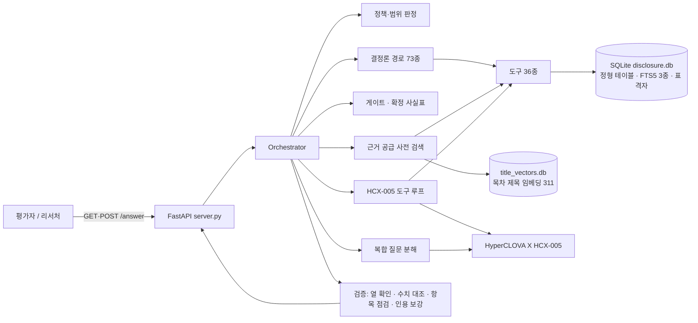

# 공시 근거 기반 AI Agent

제10회 2026 미래에셋증권 AI Festival · 공시 Agent 과제 제출물입니다.

| 항목 | 내용 |
|---|---|
| 팀 | 마크주식버그 (1인) |
| 평가 API | `http://49.50.137.93:8000/answer` (GET / POST) |
| 상태 확인 | `http://49.50.137.93:8000/health` |
| 기술 제안서 | [공시 근거 기반 AI Agent 기술 제안서.pdf](<공시 근거 기반 AI Agent 기술 제안서.pdf>) |
| API 명세 | [API_SPEC.md](API_SPEC.md) |

## 1. 무엇을 하는가

제공된 DART 공시 코퍼스(70개사, 2023.01~2026.03, 4,204건)를 구조화 DB로 만들고, 리서치 담당자가 자연어로 던지는
공시 질문에 **근거 접수번호가 붙은 답**을 돌려주는 API입니다.

- 수치·날짜·상대방·정정 이력처럼 정형으로 확정할 수 있는 사실은 SQL 규칙(결정론 경로)이 표에서 직접 꺼냅니다. 모델은 계산하지 않습니다.
- 서술·비교·구어체 질문은 관련 공시와 표를 먼저 골라 HyperCLOVA X(HCX-005)에 넘기고, 모델은 그 근거만으로 씁니다.
- 답에 적힌 숫자와 접수번호는 근거와 대조해 검증합니다. 표 셀은 단위를 곱해 원으로 환산한 뒤 비교하므로 쉼표·단위 표기가 달라도 같은 값으로 인정하고, 근거에 없는 수치는 지운 자리에 그 사실을 남기며, 다른 연도 열의 숫자는 물은 연도 열로 바로잡습니다.
- 인용은 질문이 특정한 공시 체인 안에서만 합니다. 같은 유형의 다른 연도 공시가 함께 검색돼도 그 값을 끌어오지 않습니다.
- 공시에 없는 사실은 "없다"고 말하고, 유보된 항목은 유보 사유와 기한을 답합니다.

## 2. 시스템 구성



| 계층 | 구현 | 역할 |
|---|---|---|
| 수집·파싱 | `src/parse/*` (DART XML·XForms HTML 파서) | 공시 유형별 정형 레코드, 원문 섹션, 표 격자 생성 |
| 저장·검색 | SQLite `db/disclosure.db` (FTS5 3종: 섹션·정기보고서 표·수시공시 표), 목차 제목 임베딩 `db/title_vectors.db` | 정형값과 검색 근거 보존 |
| 도구 계층 | `src/agent/tools.py`, `table_tools.py` (도구 36종) | 회사·기간·유형·표 이름으로 근거를 확정해 돌려줌 |
| 오케스트레이터 | `src/agent/orchestrator.py` | 정책·범위 판정, 결정론 경로 73종, 게이트, 사전 검색, 도구 루프, 검증 |
| 모델 | HyperCLOVA X HCX-005 (Function calling) | 도구 선택과 근거 기반 서술 |
| 제공 | FastAPI `src/agent/server.py`, systemd, Docker | GET/POST `/answer`, `/health` |

## 3. 질문 처리 흐름

1. **정책·범위 판정**. 개인정보·투자 권유·미래 전망·프롬프트 공격은 모델 호출 전에 차단합니다. 개인정보가 섞인 질문은 안전한 부분(개인 번호가 인쇄돼 있는지, 적힌 연락처가 누구 것인지)만 개인 번호 없이 답하고 나머지는 거절합니다. 코퍼스 밖 회사·기간은 정보한계로 답합니다.
2. **결정론 경로**. 질문을 정규화한 뒤 73개 규칙이 차례로 시도합니다(재무지표 6종과 분기 단독값, 증감률·순위·두 회사 비교, 계약 금액·상대·기간·정정 체인, 지분·최대주주, 자사주·증자·사채 결의, 해지, 부문·지역별 매출 표, 설비 투자 현황 표, 미상환 사채 표, 자금 사용내역 표 등). 규칙이 답하면 0초 안에 접수번호와 함께 돌아갑니다.
3. **게이트**. 규칙의 답이 질문을 다 덮는지 확인합니다. 물은 항목(얼마·몇·누구·언제·어디)마다 대상이 답에 있는지, 두 회사를 물었으면 둘 다 있는지, 물은 측면(사용실적·결말·정정 이력·조건·이유 등)이 있는지 봅니다. 일부만 답했으면 그 결과는 **확정 사실표**가 되어 모델에 넘어가고, 답변 앞에 그대로 남습니다. 물은 세부 항목(부가세 포함 여부, 단가, 정부보조금 차감 전·후, 비공개 범위, 보통주·우선주 금액 등)은 점검표로 따로 세어 빠진 항목을 정형 필드에서 채웁니다.
4. **복합 질문 분해**. 규칙이 확정하지 못한 복합 질문(물음 둘 이상, 이랑·과로 묶인 항목, 두 회사 각각)은 모델이 독립 하위 질문으로 나눕니다. 결정론으로 답이 나오는 하위 질문은 즉시 답하고, 모델 몫이 여럿이면 원 질문을 한 번에 답하되 하위 결정론 답을 사실표로 넘깁니다.
5. **근거 공급(사전 검색)**. 질문이 가리키는 보고서 연도·분기의 표와 섹션, 계약 체인과 진행상황 표, 자금 사용·조달 표, 정정 표, 기간 공시 다이제스트를 미리 넣습니다. 질문이 보고서 연도를 지목하면 정기보고서 도구 호출을 그 보고서로 고정하고, 연월로 특정한 건은 그 연월의 공시만 넣습니다. 항목이 행이고 건이 열인 가로 표는 건별 레코드로 바꿔 넘깁니다. 정형 필드를 인용할 때는 근거 범위를 확정된 공시 체인으로 좁히고, 필드가 비어 있으면 추출 누락·원문 '-'·해당사항 없음·유보를 구분한 뒤 같은 공시의 원문 필드와 표를 먼저 봅니다.
6. **도구 루프**. HCX-005가 필요한 도구를 고르고(최대 2회 재요청), 텍스트로 렌더링된 근거만 보고 답을 씁니다. 문항 예산은 80초입니다.
7. **검증**. 답의 표 숫자가 물은 연도의 열에서 왔는지 확인해 바로잡습니다. 근거의 금액은 표 셀에 단위를 곱해 원 단위 정수로 정규화해 두고, 답의 단위 수치와 원 금액을 그 집합과 대조합니다(근거 두 값의 합·차와 단위 환산은 허용). 맞지 않는 수치는 지우고 그 자리에 삭제 사실을 남깁니다. 근거가 뒷받침하지 않는 개수·증감 주장은 한계 문구로 바꾸고, 여러 해 차이를 전년 대비로 부르지 않으며, 접수번호는 뒷받침되는 문장에만 붙입니다. 철회·정정 사실을 덧붙입니다.
8. **응답**. 5개 필드 JSON. `think_trace`에는 사용 도구와 경로가 남고, `retrieved_context`에는 도구가 돌려준 근거가 그대로 실립니다.

## 4. 데이터

원본 코퍼스는 저장소에 포함하지 않으며, 아래 명령으로 런타임 DB를 만듭니다.

```bash
CORPUS_DIR=/path/to/3.공시/corpus DB_PATH=db/disclosure.db python src/build_db.py             # 정형 레코드·섹션·FTS
CORPUS_DIR=/path/to/3.공시/corpus DB_PATH=db/disclosure.db python src/build_tables.py         # 정기보고서 표 격자
CORPUS_DIR=/path/to/3.공시/corpus DB_PATH=db/disclosure.db python src/build_filing_tables.py  # 수시공시 표 격자
cd src && python -m retrieval.title_index build --batch-size 1                                  # 목차 제목 임베딩(선택)
```

| 테이블 | 건수 | 내용 |
|---|---:|---|
| `documents` | 4,204 | 공시 메타(회사·유형·접수일·정정 여부) |
| `document_sections` + `section_fts` | 146,625 | 정기보고서 목차 단위 원문 |
| `report_tables` + FTS | 628,827 | 정기보고서 표 격자(머리·행·단위) |
| `filing_tables` + FTS | 27,318 | 수시공시 본문 표 격자 |
| `financial_facts` | 6,193 | 매출액·영업이익·당기순이익·자산·부채·자본 (연결/별도, 누적/시점) |
| `contracts` / `corrections` / `terminations` | 1,106 / 2,160 / 20 | 단일판매·공급계약, 정정 전후 항목, 해지 |
| `holdings` | 1,083 | 대량보유·임원 지분 보고 |
| `major_events` / `material_events` / `investments` | 598 / 300 / 43 | 주요사항보고서, 투자판단 공시, 신규시설투자 |
| `title_vectors.db` | 311 | 정기보고서 서술 섹션 제목 임베딩(bge-m3) |

정정공시는 원공시와 체인으로 연결되어 있어(`superseded_by` / `supersedes`) 조회는 기본적으로 최신 유효 판을 돌려주고, 정정 전후 값은 `corrections`에서 읽습니다.

주요사항보고서 파서는 계약 목적·계약체결기관과 번호가 매겨진 비고 문단(취득 후 처리 계획 등)을 정형 필드로 적재합니다. 이미 만든 DB에는 `python src/backfill_major_fields.py --apply --corpus /path/to/3.공시/corpus`로 같은 규칙을 다시 적용할 수 있습니다(기본은 건수만 보고하는 dry-run).

## 5. 저장소 구조

```text
src/
  agent/
    server.py         FastAPI 진입점 (GET/POST /answer, /health)
    orchestrator.py   정책·결정론 경로·게이트·분해·사전 검색·도구 루프·검증
    tools.py          SQL·FTS 도구 36종과 HCX-005 함수 명세
    table_tools.py    정기보고서·수시공시 표 격자 도구, 가로 표 레코드 변환
    intent.py         질문 슬롯 정규화 (회사·연도·기간·지표)
    report_items.py   정기보고서 항목 파서 (직원·최대주주·연구개발·배당 등)
    clova.py          HyperCLOVA X 클라이언트 (재시도·예산·429 대기)
  parse/              DART XML/HTML 파서 (정기·수시·지분·주요사항·표)
  retrieval/          FTS5 검색, 목차 제목 임베딩 색인 (hybrid·vector_store 등은 파일럿 잔존, 런타임 미사용)
  build_db.py, build_tables.py, build_filing_tables.py   DB 구축 스크립트
  backfill_major_fields.py   기존 DB의 주요사항보고서 정형 필드 재적재 (dry-run 기본)
tests/                회귀 테스트 617개 (모델 스텁 주입, API 키 불필요)
API_SPEC.md, 공시 근거 기반 AI Agent 기술 제안서.pdf, Dockerfile, docker-compose.yml, requirements.txt
```

## 6. 실행

### Docker

```bash
git clone https://github.com/miraeasset-aifestival-2026-dart/dis-136.git
cd dis-136
cp .env.example .env            # CLOVASTUDIO_API_KEY 입력
# db/disclosure.db (필수), db/title_vectors.db (선택) 를 db/ 에 배치
docker compose up --build -d
curl http://localhost:8000/health
```

컨테이너는 비루트 사용자, 읽기 전용 파일시스템, 읽기 전용 DB 마운트, `no-new-privileges`, `/health` 검사를 적용합니다.

### 로컬

```bash
python -m venv .venv && source .venv/bin/activate        # Windows: .\.venv\Scripts\Activate.ps1
pip install -r requirements.txt
export CLOVASTUDIO_API_KEY='<CLOVA-STUDIO-API-KEY>'
python -m uvicorn agent.server:app --app-dir src --host 0.0.0.0 --port 8000
```

평가 서버는 Ncloud Ubuntu 24.04에서 systemd 유닛 `disclosure-api.service`가 같은 진입점을 구동합니다.

### 환경 변수

| 변수 | 기본값 | 설명 |
|---|---|---|
| `CLOVASTUDIO_API_KEY` | (필수) | CLOVA Studio API 키 |
| `CLOVASTUDIO_CHAT_MODEL` | `HCX-005` | 도구 호출·최종 작성 모델 |
| `CLOVASTUDIO_CHAT_URL` | v3 chat-completions | CLOVA Studio 엔드포인트 |
| `ANSWER_BUDGET_SECONDS` | `80` | 문항당 전체 예산(초). 넘기면 확보한 근거로 답함 |
| `DISCLOSURE_DISABLE_EMBED` | (비활성) | 목차 제목 임베딩 호출 끄기(테스트는 자동) |
| `CLOVASTUDIO_FINAL_MODEL` / `CLOVASTUDIO_FINAL_EFFORT` | (비활성) | 최종 작성 단계만 다른 모델로 쓰는 실험 플래그 |

런타임 DB 해시: `disclosure.db` 2,857,947,136 byte, SHA-256 `4110bdcf2441031756045a2ff7fa75a606d2c219a490d424e9bf652157263ffc`(주요사항보고서 정형 필드 재적재 반영); `title_vectors.db` 1,474,560 byte, SHA-256 `54e281aa2407069e2f7bee45bb3d814e621be47b7a09dd8e856f79d464738f10`.

## 7. API

```bash
curl --get 'http://49.50.137.93:8000/answer' \
  --data-urlencode 'question_id=Q-001' \
  --data-urlencode 'question=삼성전자의 2025년 연결 매출액과 영업이익은 각각 얼마야?'
```

```json
{
  "question_id": "Q-001",
  "question": "삼성전자의 2025년 연결 매출액과 영업이익은 각각 얼마야?",
  "retrieved_context": "[{\"tool\": \"get_financial_metric\", \"result\": {...}}]",
  "think_trace": "도구 사용: get_financial_metric ×2 (다지표 결정론적 경로)",
  "answer": "삼성전자의 2025년 연간 재무지표입니다.\n- 매출액(연결): 333,605,938,000,000원 [접수번호: 20260310002820]\n- 영업이익(연결): 43,601,051,000,000원 [접수번호: 20260310002820]"
}
```

- `/answer`는 어떤 입력에도 HTTP 200과 위 5개 필드로 응답합니다. 시간 초과·모델 오류·근거 부재는 서로 다른 문장으로 안내합니다.
- `think_trace`는 사용한 도구와 경로(결정론 경로·질문 분해·확정 사실표)의 공개 기록이며 모델의 비공개 추론이 아닙니다.
- 요청·응답 JSON 스키마와 오류 형식은 [API_SPEC.md](API_SPEC.md)에 있습니다.

## 8. 테스트

```bash
python -m unittest discover -s tests
```

617개 테스트가 `db/disclosure.db`만 있으면 모델 호출 없이 돌아갑니다(`tests/stub_client.py`가 HyperCLOVA X 자리에 들어가고 임베딩 호출은 자동으로 꺼집니다). API 계약, 정책 차단, 결정론 경로, 게이트, 분해, 수치 검증, 가로채기 회귀 세트(69문항), 그리고 코드를 모르는 외부 검사자가 API만으로 낸 블랙박스 QA(2026-09-06)의 응답·근거를 고정물로 둔 회귀 79개를 덮습니다.

## 9. 한계

- 규칙이 확정하는 단순 조회는 호출마다 같은 답이 나오지만, 모델이 쓰는 부분(서술·비교·여러 건 나열)은 호출마다 표현과 일부 수치가 달라질 수 있습니다.
- 같은 달에 같은 상대방과 맺은 계약이 여럿이면 질문만으로 건을 특정하지 못할 수 있습니다.
- 답변의 수치 검증은 근거에 있는 값·단위 환산·합차만 허용하므로, 그 밖의 계산 결과는 "(근거 표의 값과 맞지 않아 표시하지 않음)"으로 표시됩니다.
- 코퍼스 범위(70개사, 2023.01~2026.03) 밖 질문에는 범위를 명시한 정보한계 응답을 돌려줍니다. 외부 데이터는 쓰지 않습니다.

## 10. 데이터·안전 정책

- 제공 코퍼스 외의 뉴스·리포트·외부 API는 사용하지 않습니다.
- 지분공시의 생년월일·주소·연락처는 파싱 단계에서 적재하지 않습니다.
- 종목 추천·목표가·매수 시점 질문은 모델 호출 전에 거절합니다.
- API 키·서버 접속 정보·런타임 DB는 Git에 포함하지 않습니다.
