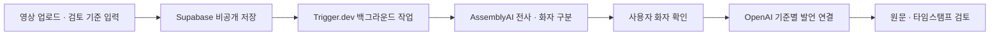

# FRAME

**채용 영상에서 필요한 발언을 찾고, 원본으로 확인하세요.**

FRAME은 지원 영상과 녹화 면접을 검토하는 채용담당자·면접관을 위한 도구입니다. 검토 기준에 해당하는 지원자의 발언을 찾아 원문과 타임스탬프로 연결합니다.

[서비스 체험하기](https://frame-interview.vercel.app/) · [개발 및 실행 안내](docs/DEVELOPMENT.md)

원티드 AI Championship 2026 해커톤 프로젝트

## 해결하려는 문제

영상에는 지원자의 경험과 생각이 담겨 있지만, 필요한 내용을 다시 찾기 어렵습니다. ‘협업 경험’이나 ‘성능 개선 과정’을 확인하려면 재생 위치를 반복해서 바꾸거나 긴 전사문을 읽어야 합니다. 면접관의 질문과 지원자의 답변이 섞여 있어 발언의 주체도 확인해야 합니다.

FRAME은 **검토 기준 → 관련 발언 → 원본 구간**을 연결해, 담당자가 근거를 찾아 확인하는 과정을 돕습니다.

## 핵심 기능

| 기능 | 설명 |
| --- | --- |
| 영상 업로드 | 지원자 단독 영상과 녹화 인터뷰 지원 |
| 한국어 전사·화자 구분 | 음성을 텍스트로 변환하고, 사용자가 지원자와 면접관 역할 확인 |
| 기준별 발언 탐색 | 직접 입력한 검토 기준에 맞춰 지원자의 관련 발언 정리 |
| 타임스탬프 재생 | 발언의 시간 표시를 눌러 원본 영상의 해당 구간 확인 |
| 근거 검토·수정 | 전체 전사 검색, 연결된 발언 추가·제외 |
| 결과 내보내기 | 검토 내용을 Markdown 파일로 저장 |

## 사용 흐름

1. **영상과 기준 준비** — MP4 영상을 업로드하고 직군을 선택하면 기본 검토 기준 4개와 공통 기준 2개를 불러옵니다. 필요하면 기준을 직접 수정하거나 추가·삭제할 수 있습니다.
2. **화자 확인** — 전사된 발언을 확인하고 지원자와 면접관을 지정합니다.
3. **관련 발언 탐색** — 기준별 결과에서 원문과 연결된 시간 구간을 확인합니다.
4. **원본 검토** — 영상을 재생해 문맥을 살펴보고, 필요한 근거를 추가하거나 제외합니다.
5. **결과 저장** — 검토 결과를 Markdown으로 내보냅니다.

## FRAME의 검토 원칙

- **원본에 연결되는 근거:** 분석 결과는 실제 전사 구간에 연결되며, 담당자가 직접 재생해 확인할 수 있습니다.
- **지원자 발언 중심:** 면접관의 발언은 질문 맥락으로 활용하고 지원자의 경험 근거와 구분합니다.
- **불확실성 표시:** 관련 발언을 찾지 못했거나 인식이 불확실한 경우를 구분합니다. 발언이 없다는 이유로 역량 부족을 판단하지 않습니다.
- **사람의 최종 판단:** 담당자가 근거를 수정할 수 있으며, 서비스는 점수·순위·합격 여부를 자동 결정하지 않습니다.

## 데모 체험

[배포된 서비스](https://frame-interview.vercel.app/)에서 별도 API 키 없이 샘플 인터뷰를 살펴볼 수 있습니다. 타임스탬프 재생, 전사 검색, 근거 수정과 내보내기를 체험해 보세요.

샘플은 직접 제작한 64초 가상 인터뷰와 합성 음성, 사전 작성된 분석 결과로 구성됩니다. 실제 영상은 업로드 후 분석할 수 있습니다.

현재 한국어 MP4 영상 **최대 50MB·15분**, 검토 기준 **3~6개**를 지원합니다. 개발·기획·디자인·마케팅 등 직군별 기본 기준을 제공합니다. 업로드 영상은 비공개로 저장되며, 24시간 보관 후 정리됩니다. 사용자가 직접 삭제할 수도 있습니다.

## 기술 구성



| 영역 | 기술 | 역할 |
| --- | --- | --- |
| 웹 | Next.js · React · TypeScript | 업로드, 영상 재생, 전사·근거 검토 화면과 API |
| 데이터 | Supabase | 검토 데이터 및 비공개 영상 저장 |
| 음성 처리 | AssemblyAI | 한국어 전사와 화자 구분 |
| 근거 분석 | OpenAI | 검토 기준과 지원자 발언 연결 |
| 작업 실행 | Trigger.dev | 전사·분석·삭제 및 만료 데이터 정리 |
| 배포 | Vercel | 웹 애플리케이션 호스팅 |

## 로컬 실행

Node.js 24와 npm을 사용합니다.

```bash
npm ci
npm run dev
```

[로컬 화면](http://127.0.0.1:3000)에서 환경변수 없이 샘플을 체험할 수 있습니다. 실제 분석 연결, 배포 설정과 테스트 방법은 [개발 안내](docs/DEVELOPMENT.md)에 정리했습니다.

## 프로젝트 구조

```text
src/
  app/          페이지와 API
  components/   영상 검토 화면
  lib/          데이터 모델, 근거 검증, 샘플 데이터
  server/       세션, 데이터베이스, 외부 API 연결
  trigger/      백그라운드 작업
supabase/       데이터베이스 초기 설정
public/demo/    가상 인터뷰 영상과 포스터
tests/         단위·브라우저 테스트
docs/          개발 안내
```
